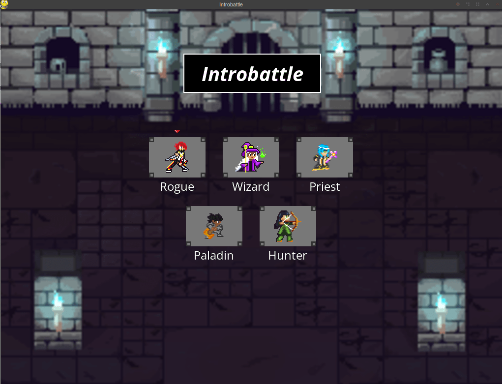
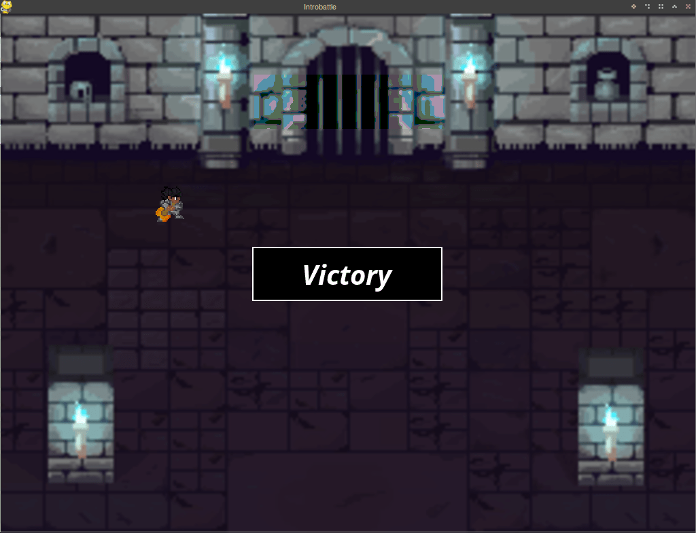

# Introbattle

This is a showcase of a game built using pygame

This project is originally part of Introcomp, a programming course of
[UFES](https://internacional.ufes.br/en/institution) for high school students of public schools

You can found more about Introcomp on:
* instagram: [@introcompufes](https://www.instagram.com/introcompufes/?hl=en)
* web: [introcomp site](https://introcomp.pet.inf.ufes.br/)

---

## How to play

Clone this repo

```bash
git clone https://github.com/paisdegales/introbattle.git
```

Navigate to the project's folder

```bash
cd path/to/introbattle
```

Install all requirements

```bash
pip freeze -r requirements.txt
```

Run the game

```bash
python main.py
```

And voila! now you can play it! hooray!

---

## Controls

### Menu

1. Press `z` to choose a character
> Choose 3 characters

### Battle

1. Press `z` to select a hero/menu entries/a target
2. Press `x` to go back one `z` press

### End

1. Use `→`, `←`, `↑` and `↓` arrows to move the character

---

## How the game looks

### Menu


### Battle


### End


---

## Folder structure

```bash
.
├── App
│   ├── Font
│   ├── Object
│   ├── Resource
│   │   ├── Background
│   │   ├── Character
│   │   │   ├── Enemy
│   │   │   └── Hero
│   │   ├── Fonts
│   │   │   ├── BricolageGrotesque
│   │   │   ├── Dosis
│   │   │   ├── Handjet
│   │   │   ├── OpenSans
│   │   │   └── SourceCodePro
│   │   └── UI
│   ├── Scene
│   │   ├── Battle
│   │   │   ├── Local
│   │   ├── End
│   │   │   ├── Local
│   │   ├── Menu
│   │   │   ├── Local
│   └── Setup
└── assets
```

---

# (some) decisions taken in this project

## No sprites
This game was made without `Sprites`.
Instead, the class `BaseObject` was created from scratch to replace the use of `Sprites`.
This has enabled me to understand deeply how operations with Surfaces and Rectangles work.

## Scene design
This game is divided into scenes.
There are three scenes: the menu, the battle and the end.
Each scene has its own folder in `App/Scene`.

## The `Screen` class
The `Screen` class is responsible for manipulating the **screen surface** and drawing
`BaseObject` instances to it.
This class allows its instances to accumulate damaged areas and refresh the screen with all changes at once.
To draw a `BaseObject` to the screen, simply input the object to the method `draw`.
To erase an object off the screen, simply input the object's `name` to the method `erase`.
To refresh a region of the screen, first queue the area to be refreshed with the method `queue` and then call the method `update`.

## The `Grid` class
This class is responsible for creating abstract grids, which can be used to create layouts for groups of `BaseObject` instances.
Maybe this was the hardest class design of this project.
It went through many modifications and it's still not good imo

## Event handling
Every scene must implement the method `event_handler`.
This method is called during the game loop and gives an event an effect.

## Animations
This game has a sort of rudimentary *animation* system.
An animation is created by simply erasing, moving and redrawing an instance of the `BaseObject` class.
All animations happen at roughly the same time, when an `ANIMATE` event is generated and added to the event queue.

## Logging
This game supports logging.
After running it, a file called `introbattle.log` is created at the root of this project's folder.
With this file you can analyze all sorts of stuff that happen behind the scenes.
Just be careful, because this file can grow a lot!

---

# Ideas left aside

- [ ] add cli support with [argparse](https://docs.python.org/3/library/argparse.html)
- [ ] add a [soundtrack](https://www.pygame.org/docs/ref/mixer.html)
- [ ] analyze ram usage with [tracemalloc](https://docs.python.org/3/library/tracemalloc.html)
- [ ] replace all variables used as 'constants' by [JSON objects](https://docs.python.org/3/library/json.html)
- [ ] create a custom class for surfaces. This would improve all logging messages related to drawing to any surface.
